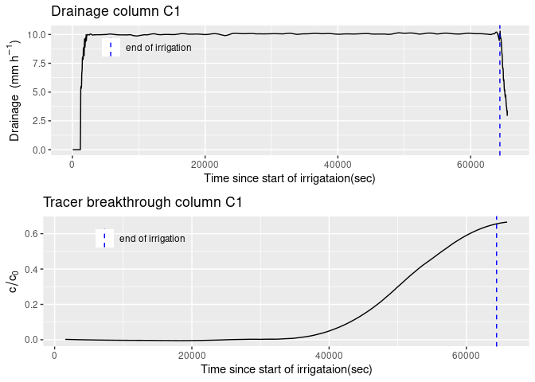
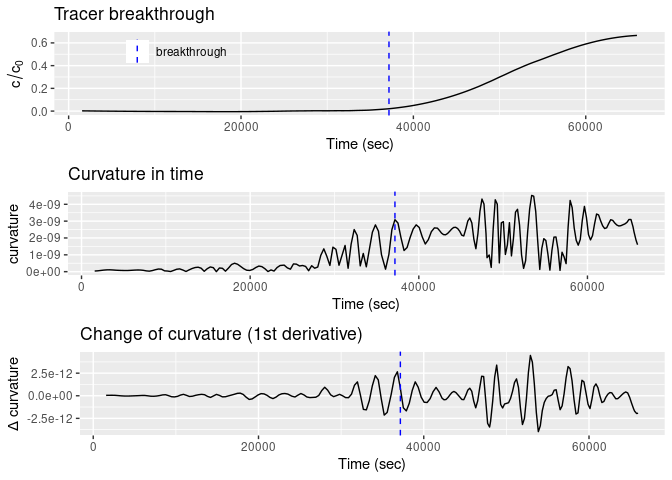
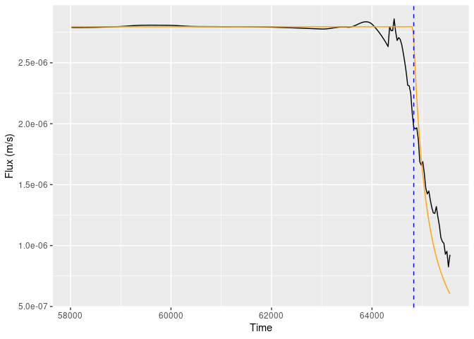

ViscousFlow
================
Christina Bogner
2021-06-11

<!-- README.md is generated from README.Rmd. Please edit that file -->

## Package aims

<!-- badges: start -->
<!-- badges: end -->

This package analyses laboratory irrigation experiments on soil columns.
It uses the viscous flow approach by Germann (2018).

## Installation

You can install ViscousFlow from GitHub with \`devoolts’ like so:

``` r
# install.packages("devtools")
devtools::install_github("ChrisBogner/ViscousFlow")
```

## Example

This is a basic example which shows you how to fit the viscous flow
equation to the decreasing limb of a drainage curve and to calculate the
viscous flow parameters 
and .

The package contains two data sets, namely `tracer` and `drainage`. Both
originate from the publication by Bogner and Germann (2019). There, it
is called column C1 and was packed from loose soil material (diameter =
15 cm and height = 30 cm) collected form a forest soil in southeast
Germany (50°08’32.8’’ N 11°51’52.9’’ E). Prior to the irrigation
experiment, the soil column was saturated from below and then drained to
field capacity. It was irrigated at 10 mm h<sup>-1</sup> during 64410
sec (17.9 h). During the experiment, a suction of -10 hPa was applied at
the bottom of the soil column to prevent saturation. The data set
`drainage` contains the drainage from this soil column C1.

The irrigation water contained Bromide that was measured in the drainage
water with an ion-sensitive electrode. The data set `tracer` contains
the normalized Bromide concentration (i.e. concentration in the drainage
divided by the concentration in the irrigation water).

Both data sets were smoothed by LOESS (see the original open access
publication Bogner and Germann (2019) for details).

Load libraries and data.

``` r
library(ViscousFlow)
library(tidyverse)
#> ── Attaching packages ─────────────────────────────────────── tidyverse 1.3.1 ──
#> ✓ ggplot2 3.3.3     ✓ purrr   0.3.4
#> ✓ tibble  3.1.2     ✓ dplyr   1.0.6
#> ✓ tidyr   1.1.3     ✓ stringr 1.4.0
#> ✓ readr   1.4.0     ✓ forcats 0.5.1
#> ── Conflicts ────────────────────────────────────────── tidyverse_conflicts() ──
#> x dplyr::filter() masks stats::filter()
#> x dplyr::lag()    masks stats::lag()
library(gridExtra)
#> 
#> Attache Paket: 'gridExtra'
#> Das folgende Objekt ist maskiert 'package:dplyr':
#> 
#>     combine

data(drainage)
data(tracer)
```

Define T<sub>B</sub> and T<sub>E</sub>, the start and end times of the
irrigation experiment.

``` r
TB <- 0
TE <- 64410
```

Plot the data.

``` r
g_all <- list(geom_line(),
  xlab('Time since start of irrigataion(sec)'),
  geom_vline(aes(xintercept = TE, col = 'TE'), lty = 2),
  scale_colour_manual(name = ' ', values = ('end of irrigation' = 'blue'),
                      labels = 'end of irrigation'),
  theme(legend.position=c(0.2, 0.9), 
        legend.background = element_rect(fill="transparent", colour=NA),          legend.key = element_rect(fill = "white"))
)

g1 <- ggplot(data = drainage, aes(x = time_sec, y = q_mmh)) + 
  g_all +
  ylab(expression(paste('Drainage  (mm ', h^{-1}, ')'))) +
  ggtitle('Drainage column C1')

g2 <- ggplot(data = tracer, aes(x = time, y = value)) + 
  g_all +
    ylab(expression(c/c[0]))  +
  ggtitle('Tracer breakthrough column C1')

grid.arrange(g1, g2, ncol = 1)
```



Calculate the breakthrough time of the tracer. The breakthrough time is
defined as the largest curvature in `time_interval`.

``` r
breakthrough <- find_tracer_breakthrough(tracer_data = tracer, time_interval = c(30000, 40000), do_plot = T)
```



``` r
breakthrough
#> $breakthrough_time
#> [1] 37169
#> 
#> $tracer_data
#> # A tibble: 213 x 6
#>     time     value smoothed_tracer tracer_first_der… curvature curvature_first_…
#>    <dbl>     <dbl>           <dbl>             <dbl>     <dbl>             <dbl>
#>  1  1560  0.00205        0.00201        -0.000000920  5.13e-11          3.74e-14
#>  2  1920  0.00171        0.00168        -0.000000902  6.51e-11          3.46e-14
#>  3  2280  0.00138        0.00136        -0.000000875  7.58e-11          2.11e-14
#>  4  2640  0.00106        0.00105        -0.000000845  8.17e-11          6.11e-15
#>  5  3000  0.000745       0.000753       -0.000000816  8.08e-11         -1.11e-15
#>  6  3360  0.000449       0.000464       -0.000000789  7.83e-11         -2.57e-15
#>  7  3720  0.000167       0.000186       -0.000000760  7.93e-11         -3.24e-16
#>  8  4080 -0.000101      -0.0000825      -0.000000730  8.07e-11          9.50e-16
#>  9  4440 -0.000359      -0.000340       -0.000000702  7.97e-11         -3.44e-15
#> 10  4800 -0.000608      -0.000588       -0.000000674  7.72e-11         -7.70e-15
#> # … with 203 more rows
```

Fit the viscous flow equation to the drainage data:

 = q_{S} \cdot \left( \frac{T_{D} - T_{E}}{t - T_{E}} \right) ^\frac{3}{2} \quad \mathrm{for} \quad T_{D} \leq t \leq \infty")

During the steady state, the irrigation intensity and the drainage flow
should be equal. From experience, calculating the flux density
 from the plateau
of the drainage flow leads to a better fit. Therefore, we set the
parameter fit\_qS = TRUE.

``` r
fit_result <- fit_drainage_tail(drainage_data = drainage, stationary_time = c(0.9 * 64410 , 64410), TE = 64410, D = 0.15,
                              qS = NULL, fit_qS = TRUE, delta_t = 30,
                              my_weights = 1)
#> Warning in stats::optimize(fit_TD, interval = TD_interval, weights =
#> my_weights, : NA/Inf durch größte positive Zahl ersetzt

#> Warning in stats::optimize(fit_TD, interval = TD_interval, weights =
#> my_weights, : NA/Inf durch größte positive Zahl ersetzt
```



The arrival times of the wetting
() and drainage
() fronts equal:

``` r
fit_result$TW
#> [1] 1260
fit_result$TD
#> [1] 64830
```

Calculate the parameters of the viscous flow, namely the celerity
, the film width
 (in
m) and the
contact area  (in
m<sup>-1</sup>).

``` r
params <- calculate_vf_parameters(TD = fit_result$TD, TE = fit_result$TE,
                                  Z = 0.3, qS = fit_result$qS)
params
#>              c        F        L
#> 1 0.0007142857 8.532995 1376.101
```

## Refereneces

<div id="refs" class="references csl-bib-body hanging-indent">

<div id="ref-Bogner2019" class="csl-entry">

Bogner, Christina, and Peter Germann. 2019. “Viscous Flow Approach to
‘Pushing Out Old Water’ from Undisturbed and Repacked Soil Columns.”
*Vadose Zone Journal* 18 (1): 180168.
<https://doi.org/10.2136/vzj2018.09.0168>.

</div>

<div id="ref-Germann2018" class="csl-entry">

Germann, Peter. 2018. *Preferential Flow Stokes Approach to Infiltration
and Drainage*. CH: Geographica Bernensia.
https://doi.org/<https://doi.org/10.4480/GB2018.G88>.

</div>

</div>
