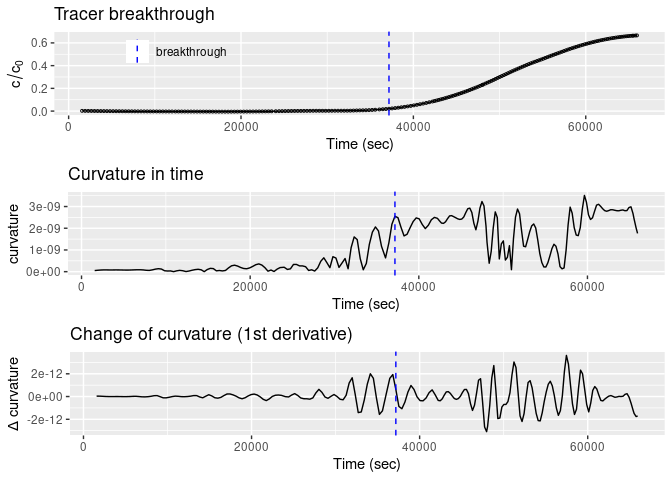

ViscousFlow
================
Christina Bogner
2020-10-27

<!-- README.md is generated from README.Rmd. Please edit that file -->

## Package aims

<!-- badges: start -->

<!-- badges: end -->

This package analyses laboratory irrigation experiments on soil columns.
It uses the viscous flow approach by Germann (2018).

## Installation

You can install ViscousFlow from GitHub with \`devoolts’ like so:

``` r
# install.packages("devtools")
devtools::install_github("ChrisBogner/ViscousFlow")
```

## Example

This is a basic example which shows you how to fit the viscous flow
equation to the decreasing limb of a drainage curve and to calculate the
viscous flow parameters \(F\) and \(L\).

The package contains two data sets, namely `tracer` and `drainage`. Both
originate from the publication by Bogner and Germann (2019). There, it
is called column C1 and was packed from loose soil material collected
form a forest soil in southeast Germany (50°08’32.8’’ N 11°51’52.9’’ E).
Prior to the irrigation experiment, the soil column was saturated from
below and then drained to field capacity. It was irrigated at 10 mm
h<sup>-1</sup> during 64410 sec (17.9 h). During the experiment, a
suction of -10 hPa was applied at the bottom of the soil column to
prevent saturation. The data set \`drainage’ contains the drainage from
this soil column C1. The data was smoothed (see the original open access
publication Bogner and Germann (2019) for details).

The irrigation water contained Bromide that was measured in the drainage
water with an ion-sensitive electrode. The data set \`tracer’ contains
the normalized Bromide concentration (i.e. concentration in the drainage
divided by the concentration in the irrigation water).

Load libraries and data.

``` r
library(ViscousFlow)
library(tidyverse)
#> ── Attaching packages ─────────────────────────────────────── tidyverse 1.3.0 ──
#> ✓ ggplot2 3.3.2     ✓ purrr   0.3.4
#> ✓ tibble  3.0.4     ✓ dplyr   1.0.2
#> ✓ tidyr   1.1.0     ✓ stringr 1.4.0
#> ✓ readr   1.3.1     ✓ forcats 0.5.0
#> ── Conflicts ────────────────────────────────────────── tidyverse_conflicts() ──
#> x dplyr::filter() masks stats::filter()
#> x dplyr::lag()    masks stats::lag()
library(gridExtra)
#> 
#> Attaching package: 'gridExtra'
#> The following object is masked from 'package:dplyr':
#> 
#>     combine

data(drainage)
data(tracer)
```

Define T<sub>B</sub> and T<sub>E</sub>, the start and end times of the
irrigation experiment.

``` r
TB <- 0
TE <- 64410
```

Plot the data.

``` r
g_all <- list(geom_line(),
  xlab('Time since start of irrigataion(sec)'),
  ylab(expression(paste('Drainage (mm ', h^{-1}, ')'))),
  geom_vline(aes(xintercept = TE, col = 'TE'), lty = 2),
  scale_colour_manual(name = ' ', values = ('end of irrigation' = 'blue'),
                      labels = 'end of irrigation'),
  theme(legend.position=c(0.2, 0.9), 
        legend.background = element_rect(fill="transparent", colour=NA),          legend.key = element_rect(fill = "white"))
)

g1 <- ggplot(data = drainage, aes(x = time_sec, y = q_mmh)) + 
  g_all +
  ggtitle('Drainage column C1')

g2 <- ggplot(data = tracer, aes(x = time, y = value)) + 
  g_all +
  ggtitle('Tracer breakthrough column C1')

grid.arrange(g1, g2, ncol = 1)
```


Calculate the breakthrough time of the tracer. The variable
`time_interval` reduces the searched time. The breakthrough time is
defined as the largest curvature in `time_interval`.

``` r
breakthrough <- find_tracer_breakthrough(tracer_data = tracer, time_interval = c(30000, 40000), do_plot = T)
```



``` r
breakthrough
#>  time 
#> 37169
```

Fit the viscous flow equation
\[q(Z,t) = q_{S} \cdot \left( \frac{T_{D} - T_{E}}{t - T_{E}} \right) ^\frac{3}{2} \quad \mathrm{if} \quad T_{D} \leq t \leq \infty\]
to the drainage data for \(t \geq T_{E}\).

## Refereneces

<div id="refs">

<div id="ref-Bogner2019">

Bogner, Christina, and Peter Germann. 2019. “Viscous Flow Approach to
‘Pushing Out Old Water’ from Undisturbed and Repacked Soil Columns.”
*Vadose Zone Journal* 18 (1): 180168.
<https://doi.org/10.2136/vzj2018.09.0168>.

</div>

<div id="ref-Germann2018">

Germann, Peter. 2018. *Preferential Flow Stokes Approach to Infiltration
and Drainage*. CH: Geographica Bernensia.
<https://doi.org/https://doi.org/10.4480/GB2018.G88>.

</div>

</div>
